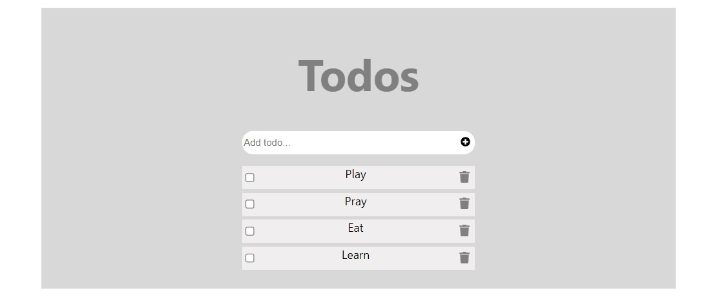

  
  
   

  <h3><b>Todo List</b></h3>

<!-- TABLE OF CONTENTS -->

# 📗 Table of Contents

- [📖 About the Project](#about-project)
  - [🛠 Built With](#built-with)
    - [Tech Stack](#tech-stack)
    - [Key Features](#key-features)
  - [🚀 Live Demo](#live-demo)
- [💻 Getting Started](#getting-started)
  - [Setup](#setup)
  - [Prerequisites](#prerequisites)
  - [Install](#install)
  - [Usage](#usage)
  - [Run tests](#run-tests)
  - [Deployment](#triangular_flag_on_post-deployment)
- [👥 Authors](#authors)
- [🔭 Future Features](#future-features)
- [🤝 Contributing](#contributing)
- [⭐️ Show your support](#support)
- [🙏 Acknowledgements](#acknowledgements)
- [❓ FAQ (OPTIONAL)](#faq)
- [📝 License](#license)

<!-- PROJECT DESCRIPTION -->

# 📖 [React_Todo_List_App] 

> Describe your project in 1 or 2 sentences.

**[React_Todo_List_App]** is a React application that implements a to-do list created to help you organize your daily activities by keeping them listed so that you can consult whenever you want, with a feature of adding, removing, and marking tasks as completed. 

## 🛠 Built With 

### Tech Stack 

> Describe the tech stack and include only the relevant sections that apply to your project.

  
Client

  <ul>
    <li><a href="https://reactjs.org/">React.js</a></li>
  </ul>

<!-- Features -->

### Key Features 

> Describe between 1-3 key features of the application.

- **[Adding_tasks]**
- **[Removing_tasks]**
- **[Marking_tasks_as_completed]**

(<a href="#readme-top">back to top</a>)

<!-- LIVE DEMO -->

## 🚀 Live Demo 

> Add a link to your deployed project.

- [Click here](https://react-todo-list-ds5z.onrender.com)

(<a href="#readme-top">back to top</a>)

<!-- GETTING STARTED -->

## 💻 Getting Started 

> Describe how a new developer could make use of your project.

To get a local copy up and running, follow these steps.

### Prerequisites

In order to run this project :

1. Make sure you have `Git installed` in your Computer or Install it by following [these steps](https://git-scm.com/book/en/v2/Getting-Started-Installing-Git))

### Setup

Clone this repository to your desired folder:

1. Download the zip file or 
2. clone with this command `git clone https://github.com/aubinleyoung/todo-list.git`
3. cd todo-list

### Install

Install this project with:

### `npm run build`

Builds the app for production to the `build` folder.\
It correctly bundles React in production mode and optimizes the build for the best performance.

The build is minified and the filenames include the hashes.\
Your app is ready to be deployed!

See the section about [deployment](https://facebook.github.io/create-react-app/docs/deployment) for more information.

### Usage

To run the project, execute the following command:
### `npm start`

Runs the app in the development mode.\
Open [http://localhost:3000](http://localhost:3000) to view it in your browser.

The page will reload when you make changes.\
You may also see any lint errors in the console.
### Run tests

To run tests, run the following command:

### `npm test`

Launches the test runner in the interactive watch mode.\
See the section about [running tests](https://facebook.github.io/create-react-app/docs/running-tests) for more information.

### Deployment

You can deploy this project using:

This section has moved here: [https://facebook.github.io/create-react-app/docs/deployment](https://facebook.github.io/create-react-app/docs/deployment)

(<a href="#readme-top">back to top</a>)

<!-- AUTHORS -->

## 👥 Authors 

> Mention all of the collaborators of this project.

## 👥 Authors 

 **Aubin SIMPEZE**

- GitHub: [@githubhandle](https://github.com/aubinleyoung)
- Twitter: [@twitterhandle](https://twitter.com/Aubin_Simpeze)
- LinkedIn: [LinkedIn](https://www.linkedin.com/in/aubin-simpeze-7a5b7a220/)

(<a href="#readme-top">back to top</a>)

<!-- FUTURE FEATURES -->

## 🔭 Future Features 

> Describe 1 - 3 features you will add to the project.

- [ ] **[Button_to_clear_all_completed_tasks]**
- [ ] **[Mobile_version]**
- [ ] **[Mor_styles_&_Animations]**

(<a href="#readme-top">back to top</a>)

<!-- CONTRIBUTING -->

<!-- CONTRIBUTING -->

## 🤝 Contributing 

Contributions, issues, and feature requests are welcome!

Feel free to check the [issues page](https://github.com/aubinleyoung/math-magicians/issues).

(<a href="#readme-top">back to top</a>)

<!-- SUPPORT -->

## ⭐️ Show your support 

Give a ⭐️ if you like this project!

(<a href="#readme-top">back to top</a>)

<!-- ACKNOWLEDGEMENTS -->

## 🙏 Acknowledgments 

- Hat tip to [Microvers](www.microverse.org)  and all the staff
- Thanks to My coding Partners 
- Thanks to My Morning-session-group and Standup-team Partners and
- Thanks to Code Reviewers

(<a href="#readme-top">back to top</a>)

<!-- LICENSE -->

## 📝 License 

This project is [MIT](./LICENSE) licensed.

(<a href="#readme-top">back to top</a>)

